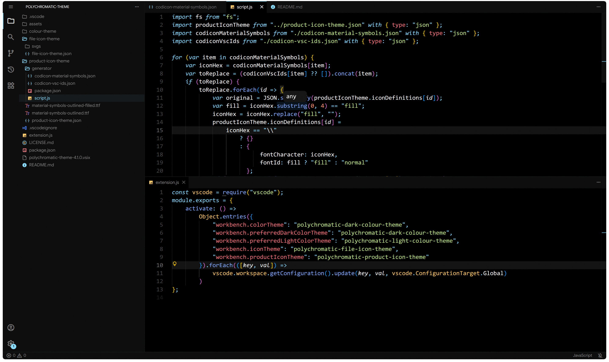
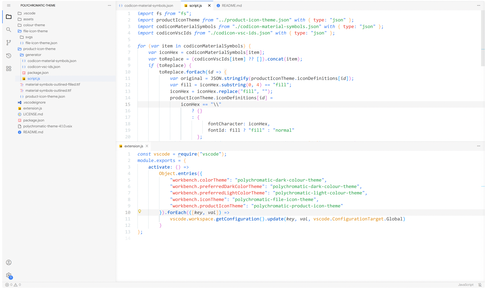
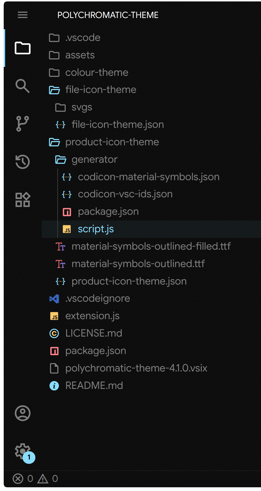
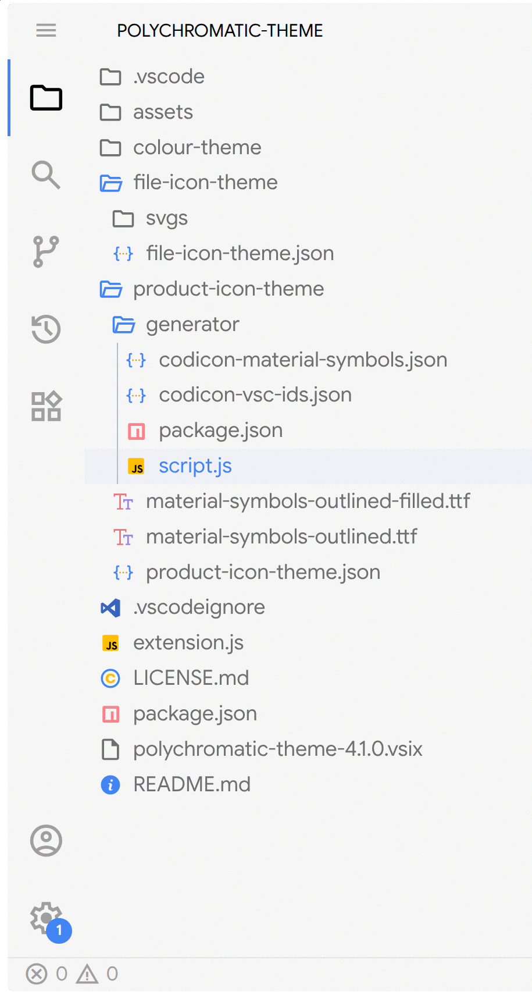

# Polychromatic theme

A colour theme, file icon theme and product icon theme for VS Code which supports light and dark mode.

### Credit
- Dark theme token colours originally from [Material Theme](https://github.com/t3dotgg/vsc-material-but-i-wont-sue-you) (specifically Material Theme Darker).
- File icon theme contains icons from [Material Theme Icons](https://github.com/kd3n1z/vsc-material-theme-icons), with some modified/replaced.
- Product icon theme uses [Material Symbols](https://fonts.google.com/icons).