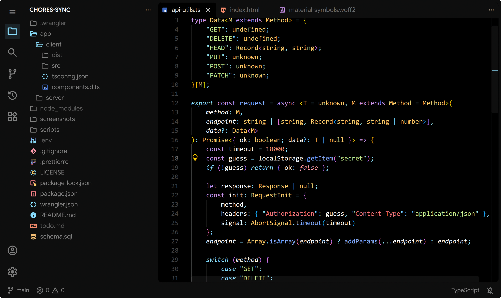
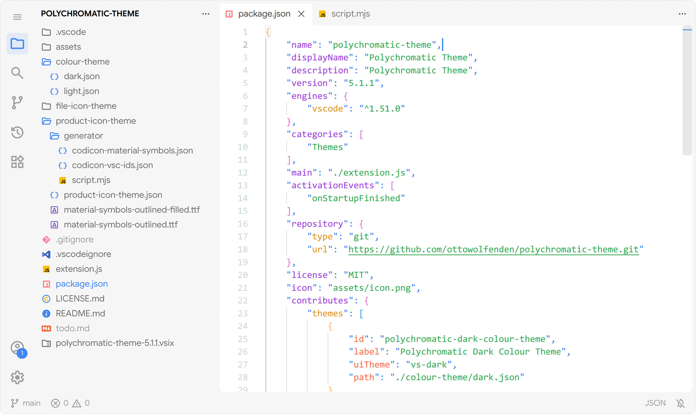

    <picture>
        <source
            media="(prefers-color-scheme: light)"
            srcset="assets/title-light.png" 
            width="700"></source>
        <source
            media="(prefers-color-scheme: dark)"
            srcset="assets/title-dark.png" 
            width="700"></source>
        
    </picture>
    <h3>Polychromatic Theme is a colour theme, file icon theme and product icon theme for VS Code which supports light and dark mode.</h3>

## Installation
I haven't published this theme on the Visual Studio Marketplace so it has to be installed with the VSIX package file.

1. Download the latest VSIX file from [Releases](https://github.com/ottowolfenden/polychromatic-theme/releases).
2. Open the command palette in VS Code (<kbd>Ctrl</kbd> + <kbd>Shift</kbd> + <kbd>P</kbd>).
3. Type "Extensions: Install from VSIX" and press <kbd>Enter</kbd>.
4. Select the polychromatic-theme.vsix file.

## Screenshots

## Credit
- Dark theme colours originally from [Material Theme](https://github.com/t3dotgg/vsc-material-but-i-wont-sue-you) (specifically Material Theme Darker).
- File icon theme contains icons from [Material Theme Icons](https://github.com/kd3n1z/vsc-material-theme-icons) and  [Material Symbols](https://fonts.google.com/icons), with some modified or replaced.
- Product icon theme uses [Material Symbols](https://fonts.google.com/icons).
